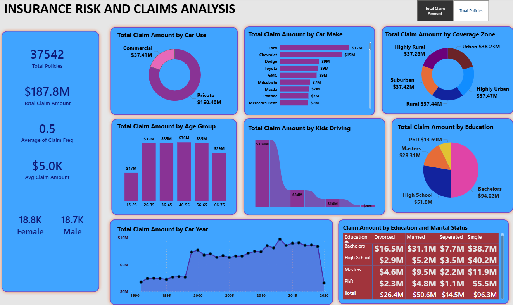
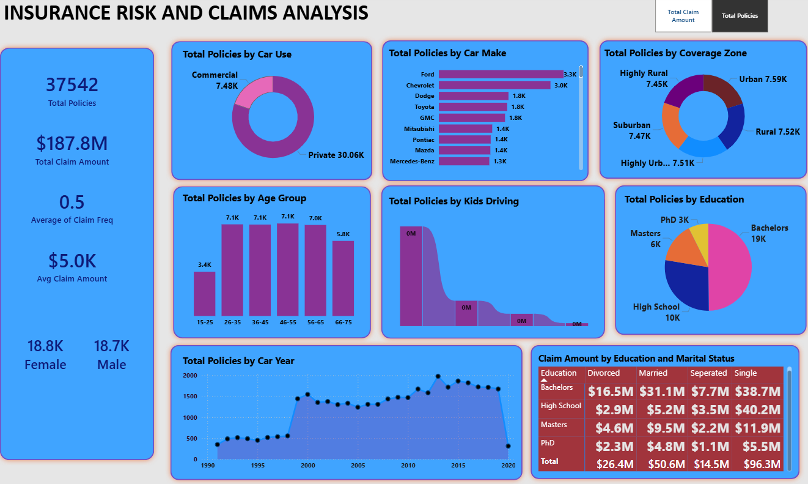

# 🛡️ Insurance Risk & Claims Analysis — Power BI Dashboard

<div align="center">


**An end-to-end Business Intelligence solution for Insurance Risk Profiling and Claims Performance Tracking**

[📊 View Dashboard Screenshots](#dashboard-preview) • [📁 Dataset Overview](#dataset-description) • [🔍 Key Insights](#key-insights) • [⚙️ Tools Used](#tools--skills-used)

</div>

---

## 📌 Project Overview

This project delivers a **fully interactive Power BI dashboard** built to help an insurance company understand its policyholder base, claim patterns, and risk exposure — all in one centralized view.

The dashboard is powered by a dataset of **37,542 insurance policies**, covering policyholder demographics, vehicle information, geographic coverage zones, and individual claim records. It was designed to replace fragmented, multi-source reporting with a single source of truth for decision-makers.

The solution includes **two dynamic report views** — one focused on **Total Claim Amount** and one on **Total Policies** — allowing stakeholders to toggle between financial impact and policy volume at a click.

---

## 🎯 Business Objective

> *"An insurance company is looking to better understand its policyholder base and claim patterns to make data-driven business decisions."*

The company faced a core challenge: **data scattered across multiple sources** made it nearly impossible to track performance, spot trends, or make strategic decisions efficiently.

**The goal was to build a centralized, interactive Power BI dashboard that answers:**
- Who are our policyholders, and how are they distributed?
- Where do our highest-value claims come from?
- Which vehicle types, geographies, and demographics represent the greatest risk?
- How do education, marital status, and age influence claim behavior?
- How has claim volume and severity trended over time?

---

## 📁 Dataset Description

**File:** `insurance_policy_date.xlsx`
**Records:** 37,542 rows | **Columns:** 16

| Column | Description |
|--------|-------------|
| `ID` | Unique policyholder identifier |
| `BirthDate` | Policyholder's date of birth (used to derive Age Group) |
| `Car Color` | Color of the insured vehicle |
| `Car Make` | Vehicle manufacturer (Ford, Chevrolet, Toyota, etc.) |
| `Car Model` | Specific vehicle model |
| `Car Use` | Usage category — **Private** or **Commercial** |
| `Car Year` | Year of vehicle manufacture |
| `Coverage Zone` | Geographic zone — Urban, Suburban, Rural, Highly Urban, Highly Rural |
| `Education` | Policyholder's education level (High School, Bachelors, Masters, PhD) |
| `Gender` | Male / Female |
| `Marital Status` | Divorced, Married, Separated, Single |
| `Parent` | Whether the policyholder is a parent (Yes/No) |
| `Claim Amount` | Dollar value of the insurance claim filed |
| `Claim Freq` | Frequency of claims filed |
| `Household Income` | Annual household income of the policyholder |
| `Kids Driving` | Number of kids in the household who drive |

---

## 🧰 Tools & Skills Used

| Category | Details |
|----------|---------|
| **BI Tool** | Microsoft Power BI Desktop |
| **Data Source** | Microsoft Excel (.xlsx) |
| **Data Modeling** | Star schema design, table relationships |
| **Query Language** | DAX (Data Analysis Expressions) |
| **Calculated Measures** | Total Claim Amount, Total Policies, Avg Claim Amount, Claim Frequency |
| **Dynamic Measures** | Field Parameters for toggling between KPI views |
| **Visualizations** | Donut Chart, Bar Chart, Histogram, Area Chart, Ribbon Chart, Pie Chart, Matrix Heat Grid |
| **UX Design** | Toggle buttons, consistent color theme, KPI cards, responsive layout |
| **Data Transformation** | Power Query (M Language) — age group binning, date parsing, data type corrections |

---

## 🔧 What We Did

### 1. 📥 Data Ingestion & Transformation (Power Query)
- Loaded raw `.xlsx` dataset into Power BI via Power Query Editor
- Cleaned inconsistent date formats in the `BirthDate` column
- Created a calculated **Age Group** column (15-25, 26-35, 36-45, 46-55, 56-65, 66-75) from `BirthDate`
- Validated and corrected data types across all 16 columns
- Handled null and edge-case values in `Claim Freq` and `Kids Driving`

### 2. 📐 Data Modeling
- Built a clean **flat table model** suitable for direct measure calculations
- Established proper data types to ensure correct aggregation behavior
- Configured table properties for optimal filter propagation

### 3. 📊 DAX Measure Development
Created all core KPIs as explicit DAX measures:
```dax
Total Claim Amount = SUM(insurance_policy_date[Claim Amount])

Total Policies = COUNTROWS(insurance_policy_date)

Average Claim Amount = AVERAGE(insurance_policy_date[Claim Amount])

Avg Claim Frequency = AVERAGE(insurance_policy_date[Claim Freq])
```

### 4. 🔀 Dynamic Dual-View Dashboard (Field Parameters)
- Implemented **Power BI Field Parameters** to create a single toggle button switching between the **Total Claim Amount** view and **Total Policies** view
- All 8 charts dynamically update their Y-axis measure based on the selected toggle — eliminating the need for duplicate report pages

### 5. 🎨 Dashboard Design & Visualization
Built 8 chart types as per business requirements:

| Chart | Purpose |
|-------|---------|
| **Donut — Car Use** | Split between Private ($150.4M) and Commercial ($37.41M) claims |
| **Bar — Car Make** | Brand-level claim ranking; Ford leads at $17M |
| **Donut — Coverage Zone** | Geographic risk distribution across 5 zones |
| **Histogram — Age Group** | Claims and policy concentration by age bracket |
| **Area — Car Year** | Claim trend by vehicle manufacture year (1990–2020) |
| **Ribbon — Kids Driving** | Impact of young household drivers on claim volume |
| **Pie — Education** | Education-level breakdown of policyholders |
| **Matrix Heat Grid — Education × Marital Status** | Combined demographic claim profiling |

---

## 📊 Dashboard Preview

### View 1 — Total Claim Amount


### View 2 — Total Policies


---

## 💡 Key Insights

### 💰 Financial Performance
- **Total Claim Amount:** $187.8M across 37,542 policies
- **Average Claim Amount:** $5,000 per policy
- **Average Claim Frequency:** 0.5 claims per policyholder

### 🚗 Vehicle Risk Insights
- **Private vehicles dominate** claims — $150.4M (80%) vs. Commercial $37.41M (20%), despite a similar policy ratio
- **Ford** is the highest-risk car brand with $17M in claims, followed by Chevrolet at $15M
- Vehicles manufactured between **2000–2018** carry the highest total claims, peaking around 2010–2015

### 🗺️ Geographic Risk
- Claim amounts are **remarkably evenly distributed** across all five coverage zones (~$37M–$38M each), suggesting zone is not a major differentiator for claim severity
- **Urban** zone carries the highest total at $38.23M; **Highly Rural** the lowest at $37.26M

### 👥 Demographic Insights
- **Age group 46–55** carries the highest claim amount ($36M) and policy count (7.1K)
- The **15–25 age group** has significantly fewer policies (3.4K) and lower claim totals ($17M), but may carry higher per-policy risk
- **Bachelor's degree** holders account for the largest share of both policies (19K) and claims ($94.02M) — driven by sheer volume

### 👨‍👩‍👧 Kids Driving Impact
- Households with **0 kids driving** represent a dramatically higher claim total ($134M) vs. those with 1 kid ($34M) or 2+ kids
- This counter-intuitive pattern suggests the policyholder base skews heavily toward non-parent or older demographics

### 💍 Education × Marital Status
- **Single + High School** is the highest-risk segment at $40.2M in claims
- **Single + Bachelor's** comes second at $38.7M
- **Married** policyholders across all education levels show moderate, stable claim behavior
- **PhD holders** represent the lowest risk across all marital statuses (total $13.69M)

### ⚖️ Gender Distribution
- Near-perfect gender balance: **18.8K Female** vs. **18.7K Male** policyholders

---

## 🏆 What We Achieved

| Outcome | Detail |
|---------|--------|
| ✅ **Centralized Reporting** | Replaced fragmented multi-source data with a single Power BI dashboard |
| ✅ **Dynamic Dual-View** | One dashboard delivers both claim amount AND policy volume analysis via toggle |
| ✅ **8 Interactive Visuals** | All charts respond to cross-filtering — drill into any segment instantly |
| ✅ **Risk Profiling** | Identified highest-risk segments: Ford vehicles, 46–55 age group, Single High School policyholders |
| ✅ **Trend Analysis** | Revealed claim growth patterns from 1990–2020 by vehicle manufacture year |
| ✅ **Executive KPIs** | 5 headline KPI cards give leadership an instant pulse on the business |
| ✅ **Scalable Model** | Power Query + DAX architecture allows the dashboard to refresh automatically when new data is added |

---

## 📂 Repository Structure

---

## 🚀 How to Run This Project

1. **Clone this repository**
```bash
   git clone https://github.com/YOUR_USERNAME/insurance-risk-analysis.git
```

2. **Open the Power BI file**
   - Install [Power BI Desktop](https://powerbi.microsoft.com/desktop/) (free)
   - Open `Insurance_risk_and_claims_analysis.pbix`

3. **Refresh the Data Source** *(if needed)*
   - Go to **Home → Transform Data → Data Source Settings**
   - Update the file path to point to `insurance_policy_date.xlsx` in your local folder
   - Click **Refresh**

4. **Explore the Dashboard**
   - Use the **Total Claim Amount / Total Policies** toggle (top-right) to switch views
   - Click any chart element to cross-filter the entire dashboard

---

## 👤 About the Author

Built as part of a portfolio project to demonstrate end-to-end Power BI development skills — from raw data ingestion and Power Query transformation, through DAX measure creation and data modeling, to professional dashboard design and stakeholder-ready reporting.

---

<div align="center">

⭐ **If you found this project helpful, please give it a star!** ⭐

[]([https://linkedin.com/in/YOUR_PROFILE](https://www.linkedin.com/in/shayan-mukherjee-a48441226/))

</div>
